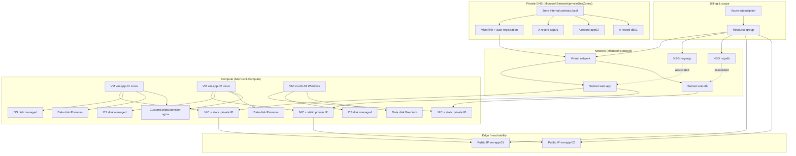

# Concepts, Azure services, and how they connect

This document explains the **ideas** behind the networking VM lab, the **Azure services** that implement them, and **how those pieces attach to one another**. For hands-on steps, use [`lab-guide.md`](./lab-guide.md).

---

## How to read this doc

- **Concept** — the thing you are modeling (e.g. “app tier subnet”).
- **Azure service / resource type** — what you create in Azure (e.g. `Microsoft.Network/virtualNetworks/subnets`).
- **Link** — a dependency: one resource references another (subnet → NSG, NIC → subnet, VM → NIC, and so on).

---

## Big picture: subscription to workload

Everything in this lab lives under a **subscription** (billing and policy boundary). You deploy into a **resource group** (a folder for lifecycle and permissions). Inside one region, the **virtual network** defines private IP space; **virtual machines** run on **compute** and talk on the network through **network interfaces**. **Disks** hold OS and data. **Private DNS** lets VMs resolve friendly names inside the VNet.

Solid arrows are typical “contains” or “uses” relationships; dotted lines show **association** (NSG bound to subnet, not stored inside the subnet object in the same way as a parent/child tree).

---

## Core concepts and Azure mappings

### Resource group

| Concept | What it is | Azure service |
|--------|------------|----------------|
| **Resource group** | Logical container for resources you deploy, delete, and permission together. | **Resource groups** — ARM/Bicep `targetScope = 'resourceGroup'` deploys *into* a group you choose (the template does not create the group in this lab’s scripts unless the script creates it first). |

**Links:** Subscription → resource group → every other resource in the lab.

---

### Virtual network and subnets

| Concept | What it is | Azure service |
|--------|------------|----------------|
| **Virtual network (VNet)** | Private RFC1918-style address space isolated per region unless you peer or connect elsewhere. | `Microsoft.Network/virtualNetworks` |
| **Subnet** | A segment of the VNet’s space; NICs get private IPs *from* a subnet. | Child of the VNet: `.../virtualNetworks/subnets` |

**Links:**

- VNet **contains** subnets (`snet-app`, `snet-db`).
- Each subnet has an **address range** inside the VNet range (`10.0.1.0/24`, `10.0.2.0/24`).
- A **network interface (NIC)** is **connected to exactly one subnet** (for this lab’s simple layout).

**Routing:** Traffic between subnets in the same VNet is allowed by the platform **unless** you add custom UDRs (this lab does not). **NSGs** then filter what L4 traffic is allowed.

---

### Network Security Group (NSG)

| Concept | What it is | Azure service |
|--------|------------|----------------|
| **NSG** | Ordered list of allow/deny rules for inbound/outbound traffic, evaluated by priority. | `Microsoft.Network/networkSecurityGroups` |
| **NSG association** | Applying an NSG to a **subnet** or a **NIC**. | Subnet property `networkSecurityGroup` or NIC property |

**Links:**

- **Subnet ↔ NSG (this lab):** `nsg-app` is associated with `snet-app`; `nsg-db` with `snet-db`. Every NIC in that subnet **inherits** those rules.
- **Rules ↔ address context:** `nsg-db` allows TCP `1433` only when the **source** is the **app subnet CIDR**. The Internet is not that source, so Internet hosts cannot use that rule to reach the DB tier.

**Contrast:** NSG on **NIC** gives per-VM granularity; NSG on **subnet** gives one policy for the whole tier—what this lab uses for teaching.

---

### Public IP and network interface

| Concept | What it is | Azure service |
|--------|------------|----------------|
| **Public IP** | A routable IPv4 address in Azure’s edge (Standard SKU here) for inbound/outbound Internet paths. | `Microsoft.Network/publicIPAddresses` |
| **Network interface (NIC)** | The VM’s attachment point to a subnet; holds **private IP** configuration (static in this lab). | `Microsoft.Network/networkInterfaces` |

**Links:**

- App VMs: NIC **primary IP config** references a **public IP** → SSH/HTTP from Internet can reach the **private** workload on the NIC (via DNAT/SNAT at the platform).
- DB VM: NIC has **no** public IP → no direct Internet path to that VM; reach it from the VNet (e.g. from an app VM) using **private IP** or **Private DNS** name.

---

### Virtual machine, OS disk, data disk, extension

| Concept | What it is | Azure service |
|--------|------------|----------------|
| **Virtual machine** | Compute instance with OS profile, hardware size, and bindings to NICs/disks. | `Microsoft.Compute/virtualMachines` |
| **OS disk** | Boot volume; created with the VM from the image. | `managedDisk` under `storageProfile.osDisk` (disk resource created implicitly with the VM) |
| **Data disk** | Extra volume (here **Premium SSD**, LUN `0`). | `Microsoft.Compute/disks` attached via `storageProfile.dataDisks` |
| **VM extension** | Post-provision configuration (scripts, agents). | `Microsoft.Compute/virtualMachines/extensions` — this lab uses **CustomScript** to install **nginx** on Linux |

**Links:**

- VM **depends on** NIC (must exist) and, in this template, **data disk** resources (empty disks created first, then **Attach** at VM create).
- Extension **depends on** VM; runs after the VM resource exists.

**Linux vs Windows:** Linux uses **SSH public key** in `linuxConfiguration`; Windows uses **username/password** (`secureString` in ARM / `@secure()` in Bicep).

---

### Private DNS zone, VNet link, A records

| Concept | What it is | Azure service |
|--------|------------|----------------|
| **Private DNS zone** | DNS zone that resolves only in linked virtual networks (split-horizon). | `Microsoft.Network/privateDnsZones` |
| **Virtual network link** | Connects the zone to a VNet; optional **auto-registration** of VM names. | `Microsoft.Network/privateDnsZones/virtualNetworkLinks` |
| **A record** | Name → IPv4 mapping inside the zone. | `Microsoft.Network/privateDnsZones/A` |

**Links:**

- Zone **linked to** `vnet-prod` → VMs in that VNet use Azure-provided DNS to resolve names in `internal.contoso.local`.
- **Auto-registration:** can create records from VM hostnames automatically.
- **Manual A records** (`app01`, `app02`, `db01`): point to the **same static private IPs** as the NICs—stable aliases for labs and scripts regardless of computer name quirks.

**Flow:** VM asks Azure DNS for `db01.internal.contoso.local` → DNS returns the **private IP** of `vm-db-01` → traffic stays **inside** the VNet (no Internet required for that name).

---

## Traffic and control-plane stories (mental models)

### Inbound from Internet to an app VM

Internet → **Public IP** → **NSG on `snet-app`** (allow 22/80/443, then deny) → **NIC** → VM. The DB VM never appears on this path because it has **no** public IP.

### App tier to DB tier on port 1433

Source IP is in **`10.0.1.0/24`** (app subnet). **NSG on `snet-db`** allows TCP `1433` from that prefix. SQL Server is not installed by the template; the rule models how you would expose SQL only to the app subnet.

### Name resolution inside the VNet

Query for `app02.internal.contoso.local` goes to **Azure DNS for the linked Private zone** → **A record** (or auto-registered name) → **private IP** of the target NIC.

---

## How this maps to the Bicep modules

| Module | Main concepts | Key links created |
|--------|----------------|-------------------|
| [`network.bicep`](../bicep/network.bicep) | VNet, subnets, NSGs | NSGs → associated to subnets; subnets live in VNet |
| [`storage.bicep`](../bicep/storage.bicep) | Managed data disks | Standalone disks; IDs passed to compute |
| [`compute.bicep`](../bicep/compute.bicep) | Public IPs, NICs, VMs, extensions | PIP → NIC; NIC → subnet; disks → VM; extension → Linux VMs |
| [`dns.bicep`](../bicep/dns.bicep) | Private zone, link, A records | Zone ↔ VNet link; A records → known private IPs |
| [`main.bicep`](../bicep/main.bicep) | Orchestration | Passes subnet IDs and disk IDs between modules in order |

The **ARM** template [`azuredeploy.json`](../arm/azuredeploy.json) expresses the **same** relationships in a single file; the dependency graph is equivalent.

---

## Portal cheat sheet

| Concept | Where to look in Azure Portal |
|--------|-------------------------------|
| VNet / subnets | Virtual networks → your VNet → Subnets |
| NSG rules | Network security groups → Inbound/Outbound rules; **Effective security** on NIC or subnet |
| VM disks | Virtual machine → Disks |
| Public IP | Public IP addresses |
| Private DNS | Private DNS zones → Records + **Virtual network links** |

---

## Related reading in this repo

- [`lab-guide.md`](./lab-guide.md) — tasks, CLI, validation.
- [`validation-checklist.md`](./validation-checklist.md) — what to verify after deploy.
- [`lab.md`](../lab.md) — original specification.
